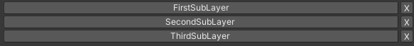
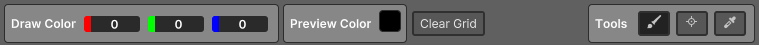
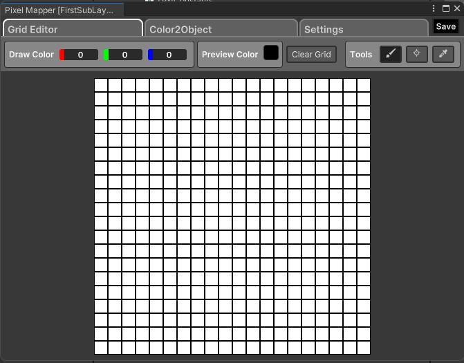
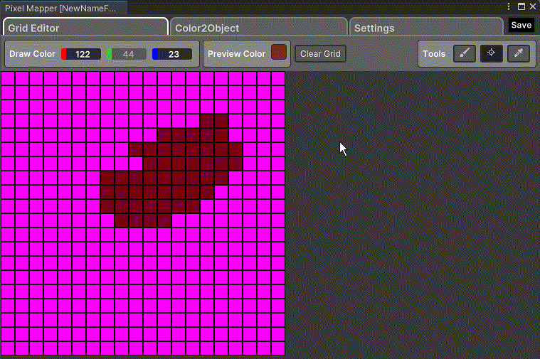
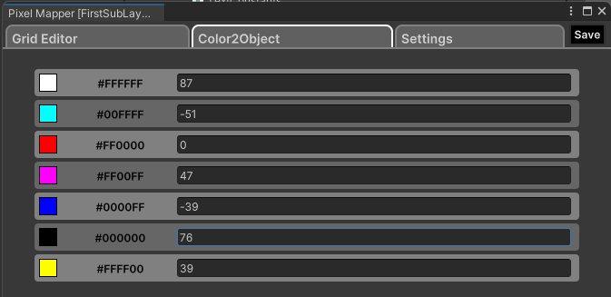
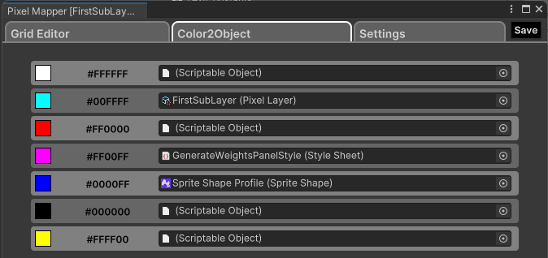
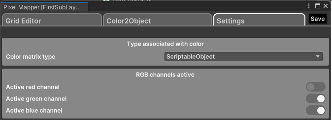
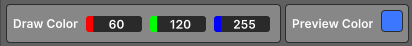
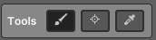
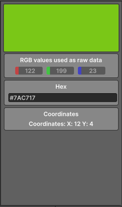

# **✨ Pixel Mapper Documentation ✨**

This guide covers the Pixel Mapper, a tool for mapping pixel values to data types. The Pixel Mapper allows for the creation of complex setups using a grid layout.

## **🚀 Getting Started**

To begin using the Pixel Mapper, follow these steps:

1. Copy this Git repository URL: [PixelMapper](https://gitlab.com/davide.balan.official/pixelmapper.git).
2. In the Unity window, go to "Assets" -> "Import Package" -> "Custom Package" and paste the Git repository URL to import the plugin.
3. Create a new Pixel Mapper object by selecting 'Create > MatrixMapData' in the 'Assets' panel or by right-clicking in the inspector. This will launch a wizard to name the main asset, the first sub-asset, and set the grid size for all sub-assets.

For a more detailed explanation on managing assets, refer to [Managing Assets](#managing-assets).

## **📦 Managing Assets**

From here, you can manage your assets effectively:

- **➕ Create a New Layer**: Name the new layer "Untitled".

- **✏️ Rename a Layer**: Select the sub-asset, change its name in the inspector by editing the 'Name' field, and click 'Rename'.

- **🔘 Buttons Overview**: You'll see a list of buttons with the names of the sub-assets. Click on one to open the tool, or click '❌' to remove the sub-asset (at least one sub-asset must remain). There’s also a button for quick access to the last layer you opened.

For a simpler overview, refer to [Getting Started](#getting-started).

## **🛠️ Description of the Tool**

The tool is divided into three main sections:

- **🖌️ Grid Editor**: View and edit the grid.
- **🔀 Color2Object**: Associate pixels with values of a selected type across the grid.
- **⚙️ Settings**: Configure the type associated with the pixel and specify which RGB channels to use.

### **🖌️ Grid Editor**

#### **🔧 Toolbar**

- **🎨 Color Selector**: Choose the pen color and see a preview of the selected color.
- **🗑️ Clear Grid**: Reset the grid to the default color (White).
- **🔧 Tools**:
  - **🖌️ Paint Tool**: Draw with the selected color (LMB) or erase (RMB).
  - **🔍 Inspect**: Select a pixel to see its details.
  - **🎯 Picking**: Copy the selected pixel’s color to the color selector.

For a more detailed explanation on how to use these tools, refer to [How to Use Grid Editor](#how-to-use-grid-editor).

#### **📊 Grid**

The grid is the main workspace where you view and draw pixels. When using the **Inspect** tool, the selected pixel is highlighted with a contrasting border.

For more details on working with the grid, refer to [How to Use Grid Editor](#how-to-use-grid-editor).

#### **🔍 Inspector**

The inspector panel shows the true color of the pixel regardless of any RGB channel filters applied, an editable hexadecimal color value, and the pixel's coordinates.

### **🔀 Color2Object**

#### **🔢 Relation Color-Integer**

#### **📜 Relation Color-ScriptableObject**

In this panel, you can associate pixels with values of a selected type for the entire grid. All colors in the grid are included.

For a simpler overview of the Color2Object panel, refer to [How to Use Color2Object](#how-to-use-color2object).

### **⚙️ Settings**

There are some settings that can change the behaviour and representation of the tool.

For more detailed explanations of the settings, refer to [How to Use the Settings](#how-to-use-the-settings).

## **📖 How to Use Grid Editor**

### **🎨 Color Selection**

The color can be set by editing the RGB channels in **Draw Color** and looking at **Color Preview** to know what color will be used.

### **🔧 Tools**

A collection of tools used on the grid:

#### **🖌️ Paint Tool**

With this tool, you can paint on the grid. To paint, click/drag with the Left Mouse Button and erase with the Right Mouse Button.

#### **🔍 Inspect**

With this tool, you can click on a pixel in the grid to view details about the selected pixel, including the true color, RGB fields, hexadecimal value, and coordinates.

#### **🎯 Picking**

With this tool, you can pick the color of the selected pixel and transpose it to **Draw Color**.

For a simpler overview of these tools, refer to [Grid Editor](#grid-editor).

## **📦 How to Use Color2Object**

Depending on the type selected for the Color-Object association, how you can modify it may differ, but fortunately, it works like a normal Unity inspector input field.

The supported types are indicated in [Supported Type](SupportedType.md).

For a more detailed explanation on the Color2Object panel, refer to [Color2Object](#color2object).

## **⚙️ How to Use the Settings**

### **🔣 Color Matrix Type**

This setting affects Color2Object by determining the type associated with each color. Changing this setting will clear all previous associations, so change it only once to avoid losing the associations.

### **🌈 Active (Red/Green/Blue) Channel**

This setting affects:

- The representation of the color in the **Grid Editor**, excluding some channels.
- Disabling and resetting the channel of **Draw Color** affects **Color Preview**.
- The channel deactivated in the settings will enable that channel in the inspector that allows it to be edited.
- **Color2Object** will refresh the association with the new color, and the old association will be hidden until the channel is restored to its previous state.

For a simpler overview of the settings, refer to [Settings](#settings).

## **🔍 Explanation of How It Works Behind the Scenes**

### **🗺️ How the Grid Coordinates are Represented**

The main reason is to work natively with Unity's coordinate system.

Like Unity, the Up direction is represented by the Y-axis from bottom to top, and the Right direction is represented by the X-axis from left to right.

The coordinate system is like Unity's P(X, Y) for the direction D(Right, Up).

### **🔄 How the Data Association Works**

#### **🔧 From Tool to Sublayer**

After finishing assigning a value to the association, the data is assigned as a C# *object*.

Once we click on **Save**, we parse the *object* byte by byte, resulting in an array of bytes that can be serialized.

For the conversion object->byte[], the type must have System.Serializable. For types that can't be natively serialized, I use a custom method to organize data for serialization.

For example, a Vector3 will

 become float[3], which is natively serialized. In summary, Vector3 -> float[3] (surrogate) -> *object* -> byte[].

#### **🔄 From Sublayer to Tool or for User Use**

This works like the "From Tool to Sublayer" process but in reverse.

For example, in the tool with a Vector3, byte[] is used to build an *object*. Based on the type in **Settings**, **Color2Object** creates the appropriate field, casts it to the correct type (or surrogate), and sets the field with the value.

Meanwhile, a user who wants the data of a specific pixel (using coordinates) will follow the same process: byte[] -> build *object* -> cast to surrogate (if needed) -> rebuild original type, and lastly, provide it to the player.

Note: Retrieving the data requires specifying the type as Generic, which can differ from the type of the sublayer only if it can be cast; otherwise, it will give an error.

Example: T must be a type that can cast the data of the type set in the settings.

    PixelPack<T> pixelPack = new PixelPack<T>(pixelLayers);
    PixelOutput<T> point = pixelPack.GetPixelOutput(1,4);

## TODO of README
- Explain how a grid of color work combined with Color2Object
- Explain i can turn off a RGB channel and for what purpose
- Explain how use the assets
    - First using sub asset
    - Later using main asset
- Create a demo project with some examples
