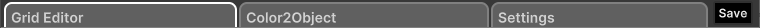

# **Pixel Mapper Documentation**

This guide covers the Pixel Mapper, a tool for mapping pixel values to a data types. The Pixel Mapper allows for the creation of complex setups using a grid layout.

## **Getting Started**

To begin using the Pixel Mapper, you need to create a new Pixel Mapper object. In the 'Assets' panel or by right-clicking in the inspector, select 'Create > MatrixMapData'.

This will launch a wizard where you'll name the main asset and the first sub-asset. You'll also set the grid size for all sub-assets.

## **Managing Assets**

From here, you can create a new layer named "Untitled".

To rename a layer, select the sub-asset, change its name in the inspector by editing the 'Name' field, and click 'Rename'. The sub-asset will be selected immediately after its creation.

### **Buttons Overview**

You'll see a list of buttons with the names of the sub-assets. Click on one to open the tool, or click 'X' to remove the sub-asset (at least one sub-asset must remain).

There’s also a button for quick access to the last layer you opened.

## **Description of the Tool**

The tool is divided into three sections:
- **Grid Editor**: View and edit the grid.
- **Color2Object**: Associate pixels with values of a selected type across the grid.
- **Settings**: Configure the type associated with the pixel and specify which RGB channels to use.

### **Grid Editor**

#### **Toolbar**

- **Color Selector**: Choose the pen color and see a preview of the selected color.
- **Clear Grid**: Reset the grid to the default color (White).
- **Tools**:
  - **Paint Tool**: Draw with the selected color (LMB) or erase (RMB).
  - **Inspect**: Select a pixel to see its details.
  - **Picking**: Copy the selected pixel’s color to the color selector.

#### **Grid**

The grid is the main workspace where you view and draw pixels. When using the **Inspect** tool, the selected pixel is highlighted with a contrasting border.

#### **Inspector**

The inspector panel shows the true color of the pixel regardless of any RGB channel filters applied, an editable hexadecimal color value, and the pixel's coordinates.

### **Color2Object**

#### **Relation Color-Interger**

#### **Relation Color-Scriptable**

In this panel, you can associate pixels with values of a selected type for the entire grid. All colors in the grid are included.

### **Settings**

In the settings panel, you define the type associated with the pixel.

#### **RGB Channels**

There are three toggles to include or exclude RGB channels in pixel representation. For example, turning off the Red channel will display RGB(1f, 1f, 0.5f) as RGB(0f, 1f, 0.5f). This affects representation and association only; the actual pixel color remains unchanged for data purposes.

## How use GridEditor

### Color Selection

The color can be set by editing the RGB channels in **Draw Color** and look in **Color Preview** to know what color will be used.

### Tools

A collection of tool used on the grid

#### Paint Tool

With this tool you can paint on the grid.

To Paint click/drag with Left Mouse Button and erase with Right Mouse Button.

#### Inspect

With this tool you can click on a pixel in the grid to view details about the selected pixel.

First we see the *real* color ignores the disabled channels in the settings, this is because the *real* color takes the color values ​​of the active channel plus the disabled channel set by the inspector.

Next we can see an rgb field where the only editable values ​​are that of the deactivated channel, this can be used as extra data together with the selected type.

Same thing can be done with the hexadecimal value of the color that allow fast copy paste if needed.

Lastly we can see coordinate of the pixel in the grid as (X,Y)

#### Picking

With this tool you can pick the color of the pixel selected and traspose it to **Draw Color**.
